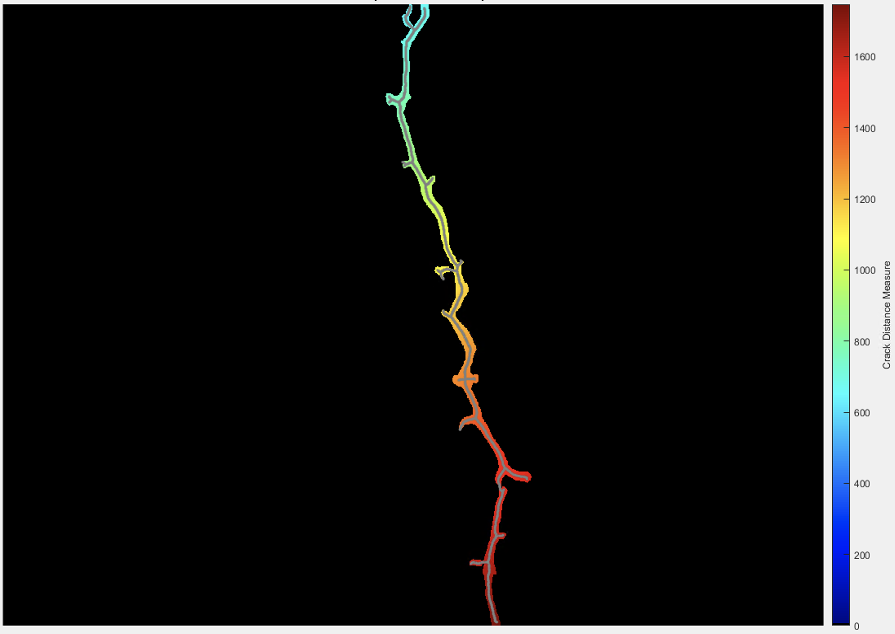
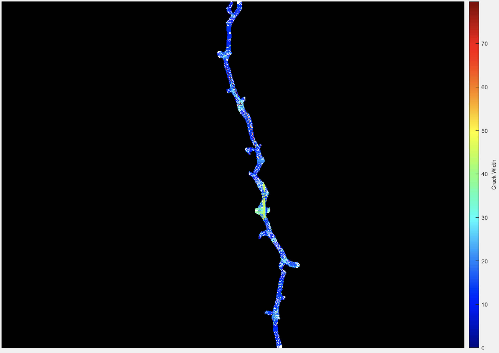

# Introduction
[](https://www.mathworks.com/matlabcentral/fileexchange/176438-crack-width-calculation-and-visualization) [](https://matlab.mathworks.com/open/github/v1?repo=preethamam/Crack-Width-Calculation-Visualization-MATLAB) 

Calculates the crack width based on the ellipse major axis orientation and Bresanham line traversing and follows a comprehensive visualization code.

# Quick Pipeline Visualization
## Example: Crack width visualization
| Crack image | Distance map | Crack width |
| ------------- | ------------- | ------------- |
|  |  |  |

# Requirements
MATLAB

# Citation
Crack width calulation and comprehensive visualization code is available to the public. If you use this code in your research, please use the following BibTeX entry to cite:
```bibtex
@PhdThesis{preetham2021vision,
author = {{Aghalaya Manjunatha}, Preetham},
title = {Vision-Based and Data-Driven Analytical and Experimental Studies into Condition Assessment and Change Detection of Evolving Civil, Mechanical and Aerospace Infrastructures},
school =  {University of Southern California},
year = 2021,
type = {Dissertations & Theses},
address = {3550 Trousdale Parkway Los Angeles, CA 90089},
month = {December},
note = {Condition assessment, Crack localization, Crack change detection, Synthetic crack generation, Sewer pipe condition assessment, Mechanical systems defect detection and quantification}
}
```

# Feedback
Please rate and provide feedback for the further improvements.
